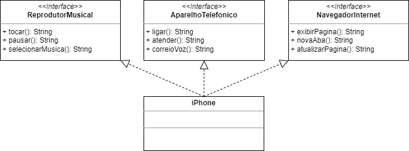

# Bootcamp Desenvolvimento Java com Cloud AWS - Desafio de Projeto
Projeto prático: diagramação de classes do iPhone

## Representação UML

## Arquivos
### Interfaces
- AparelhoTelefonico.java
- NavegadorInternet.java
- ReprodutorMusical.java
### Classes
- Iphone.java
- Main.java
